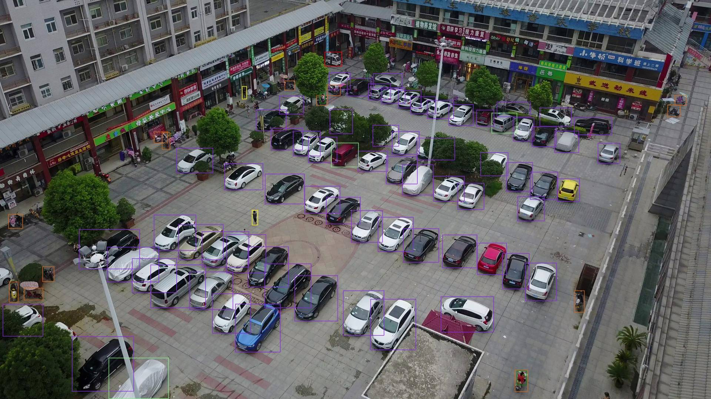

# Object Detection for VisDrone(无人机航拍图像目标检测)
## My environment
1、Windows10 (Linux available)    
2、tensorflow >= 1.12.0   
3、python3.6 (anaconda)  
4、cv2       
5、ensemble-boxes(pip install ensemble-boxes)
## Datasets(XML format for training set)
**(1).Datasets is available on https://github.com/VisDrone/VisDrone-Dataset**    
**(2).Please download xml annotations on [Baidu Yun](https://pan.baidu.com/s/1n1NFkOS3-BgBcKQ5b3DBSQ) (提取码: ia3f), or [Google Drive](https://drive.google.com/file/d/1WgoqZMFCPDa4vDeGEoCNqZiuMkdKpvXw/view?usp=sharing), and configure it in ./core/config/cfgs.py**                 
**(3).You can also use ./data/visdrone2xml.py to generate your visdrone xml files, modify the path information.**       
```
training-set format:

├── VisDrone2019-DET-train
│     ├── Annotation(xml format)
│     ├── JPEGImages
```

## Pretrained Models(ResNet50vd, 101vd)
**Please download pretrained models on [Baidu Yun](https://pan.baidu.com/s/1F_fZRRxweHJn8S3p3WdbDw) (提取码: krce), or [Google Drive](https://drive.google.com/drive/folders/1vu3yqmazeQes8am64kLxghbuSthfDgCD?usp=sharing), then put it into ./data/pretrained_weights**      

## Train
```
Modify the parameters in ./core/config/cfgs.py
python train_step.py
```     
## Eval
```
Modify the parameters in ./core/config/cfgs.py
python eval_visdrone.py, it will get txt format file, then use official matlab tools to eval the final results.
python eval_model_ensemble.py. Before the running of this file, you should set NORMALIZED_RESULTS_FOR_MODEL_ENSEMBLE=True in cfgs.py and then run eval_visdrone.py to get normalized txt result.
```   

## Visualization
```
Modify the parameters in ./core/config/cfgs.py
python image_demo.py, it will get visualized results.
```   
**Visualized Result (multi-scale training+multi-scale testing)**


## Test Result(Validation set)：
### 1. ResNet50-vd
#### Note：        
- **May 10, 2021:** We observe a better accuracy when setting larger short size(1200) with ResNet50-vd, it will achieve 33.85%(+2.59%) in AP0.50:0.95 and 36.17%(+1.07%) in multi-scale testing(800,1000,1200,1400,1600). You can also try a larger short size if GPU memory is enough to train, it may increase the final accuracy.

Name|maxDets|Result(s/m)
---------------|------------------|----------------
Average Precision  (AP) @( IoU=0.50:0.95) | maxDets=500  | 31.26%(33.85%)/35.1%
Average Precision  (AP) @( IoU=0.50     ) | maxDets=500  | 56.44%/60.29%
Average Precision  (AP) @( IoU=0.75     ) | maxDets=500  | 30.13%/35.42%
Average Recall     (AR) @( IoU=0.50:0.95) | maxDets=  1  | 0.78%/0.58%
Average Recall     (AR) @( IoU=0.50:0.95) | maxDets= 10  | 6.62%/6.05%
Average Recall     (AR) @( IoU=0.50:0.95) | maxDets=100  | 38.21%/40.99%
Average Recall     (AR) @( IoU=0.50:0.95) | maxDets=500  | 48.41%/53%
##### "s" means single-scale training + single-scale testing; "m" means multi-scale training + multi-scale testing
### 2. ResNet101-vd
Name|maxDets|Result(s/m)
---------------|------------------|----------------
Average Precision  (AP) @( IoU=0.50:0.95) | maxDets=500  | 31.7%/35.98%
Average Precision  (AP) @( IoU=0.50     ) | maxDets=500  | 56.94%/61.64%
Average Precision  (AP) @( IoU=0.75     ) | maxDets=500  | 30.59%/36.13%
Average Recall     (AR) @( IoU=0.50:0.95) | maxDets=  1  | 0.67%/0.61%
Average Recall     (AR) @( IoU=0.50:0.95) | maxDets= 10  | 6.29%/6.13%
Average Recall     (AR) @( IoU=0.50:0.95) | maxDets=100  | 38.66%/42.33%
Average Recall     (AR) @( IoU=0.50:0.95) | maxDets=500  | 49.29%/53.68%
### 3. Model Ensemble (ResNet101-vd+ResNet50-vd)
Name|maxDets|Result
---------------|------------------|----------------
Average Precision  (AP) @( IoU=0.50:0.95) | maxDets=500  | 36.76%
Average Precision  (AP) @( IoU=0.50     ) | maxDets=500  | 62.33%
Average Precision  (AP) @( IoU=0.75     ) | maxDets=500  | 37.41%
Average Recall     (AR) @( IoU=0.50:0.95) | maxDets=  1  | 0.59%
Average Recall     (AR) @( IoU=0.50:0.95) | maxDets= 10  | 6.06%
Average Recall     (AR) @( IoU=0.50:0.95) | maxDets=100  | 42.57%
Average Recall     (AR) @( IoU=0.50:0.95) | maxDets=500  | 54.53%
##### You can download trained weights(ResNet50vd, 101vd) on [Baidu Yun](https://pan.baidu.com/s/1jsQn0Fb5qpzzFZphrFZW5Q) (提取码: 9u9m), or [Google Drive](https://drive.google.com/drive/folders/1rzq8sJ4pYFVbW2qB7vXVCot0cuSYcoZQ?usp=sharing), then put it into ./saved_weights

## Reference
1、https://github.com/DetectionTeamUCAS/Faster-RCNN_Tensorflow       
2、https://github.com/open-mmlab/mmdetection     
3、https://github.com/ZFTurbo/Weighted-Boxes-Fusion      
4、https://github.com/kobiso/CBAM-tensorflow-slim        
5、https://github.com/SJTU-Thinklab-Det/DOTA-DOAI        
6、https://github.com/Viredery/tf-eager-fasterrcnn       
7、https://github.com/VisDrone/VisDrone2018-DET-toolkit      
8、https://github.com/YunYang1994/tensorflow-yolov3      
9、https://github.com/zhpmatrix/VisDrone2018
